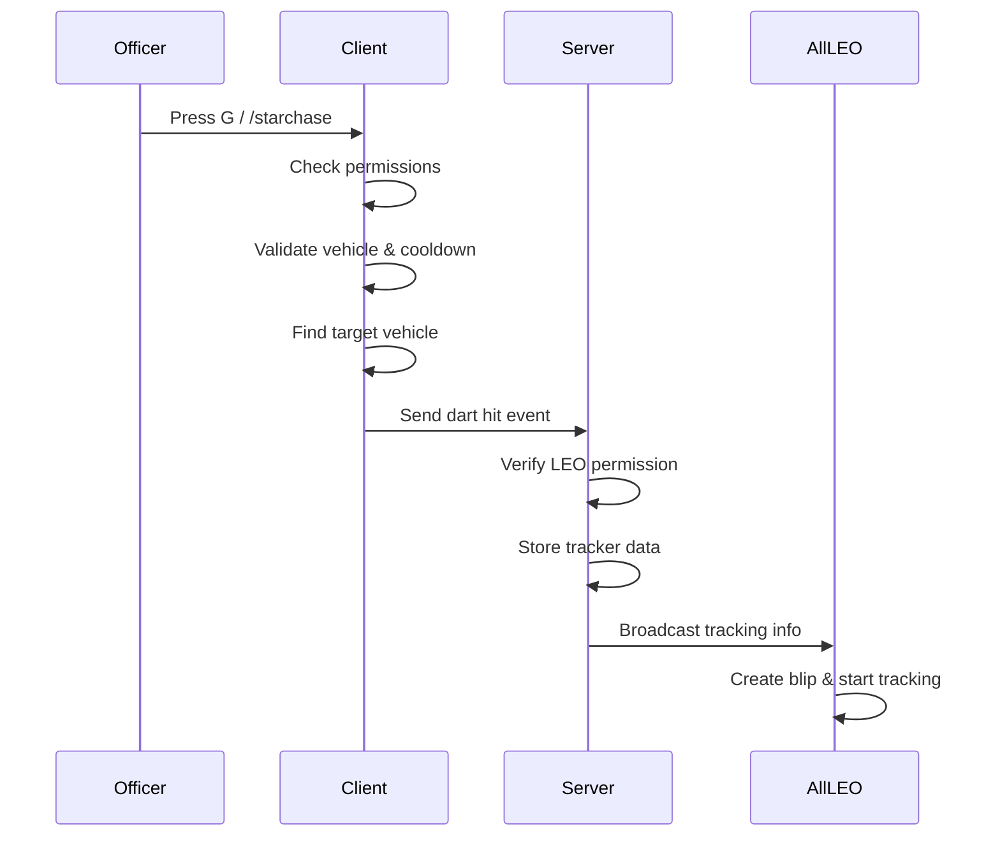

# 🎯 StarChase GPS Pursuit System

<div align="center">


**A realistic GPS dart tracking system for FiveM law enforcement roleplay**

*Fire GPS darts at fleeing vehicles • Track suspects on the map • LEO-only with Discord permissions*

[Features](#-features) • [Installation](#-installation) • [Configuration](#%EF%B8%8F-configuration) • [Commands](#-commands) • [Support](#-support)

---

</div>

## 📋 Overview

**StarChase GPS Pursuit System** brings real-world police pursuit technology to your FiveM server. Based on the actual StarChase system used by law enforcement agencies, this script allows officers to deploy GPS tracking darts onto fleeing vehicles, enabling continuous tracking on the map without maintaining visual contact.

Perfect for:
- 🚔 Serious RP police servers
- 🏎️ High-speed pursuit scenarios  
- 🎮 Enhanced LEO gameplay
- 🔒 Discord-integrated permission systems

---

## ✨ Features

### 🎯 GPS Dart System
- **Realistic Deployment** - Fire GPS darts from police vehicles at suspects
- **Smart Targeting** - Automatic vehicle detection with raycast system
- **Cooldown System** - Prevent spam with configurable cooldown
- **Range Limiting** - Realistic engagement distance (25m default)

### 🗺️ Advanced Tracking
- **Real-time Blips** - Animated tracking blips follow tagged vehicles
- **Route Display** - GPS route line to tracked vehicle
- **3D Markers** - Visual marker above tracked vehicles when nearby
- **Multi-track Support** - Track multiple vehicles simultaneously
- **Synced Tracking** - All LEO officers see the same tracks

### 🔔 Beautiful Notifications
- **Modern UI** - Glassmorphism design with smooth animations
- **Color-coded Alerts** - Success, error, warning, and info states
- **Progress Indicators** - Visual countdown for notifications
- **High-tech Aesthetic** - Orbitron & Rajdhani fonts

### 🔒 Permission System
- **Discord Integration** - Uses Discord roles for LEO permissions
- **Ace Permissions** - Compatible with DiscordAcePerms / Badger Discord API
- **Admin Bypass** - Optional admin override capability
- **Secure Validation** - Server-side permission checks

---

## 📸 Preview

<div align="center">

| GPS Dart Fired | Tracking Active | Notifications |
|:--------------:|:---------------:|:-------------:|
|  |  |  |

</div>

---

## 📦 Installation

### Requirements
- FiveM Server (Latest recommended)
- [DiscordAcePerms](https://github.com/JaredScar/DiscordAcePerms) or similar
- [Badger_Discord_API](https://github.com/JaredScar/Badger_Discord_API)

### Steps

1. **Download** the latest release
   ```bash
   git clone [https://github.com/yourusername/starchase](https://github.com/RagnarTheGreat/Fivem-Star-Chase).git
   ```

2. **Extract** to your resources folder
   ```
   resources/
   └── starchase/
       ├── client.lua
       ├── config.lua
       ├── server.lua
       ├── fxmanifest.lua
       └── html/
           ├── index.html
           ├── style.css
           └── script.js
   ```

3. **Configure** the `config.lua` to match your server setup

4. **Add to server.cfg**
   ```cfg
   # Make sure Discord permissions load first
   ensure Badger_Discord_API
   ensure DiscordAcePerms
   
   # Then load StarChase
   ensure starchase
   ```

5. **Restart** your server

---

## ⚙️ Configuration

All settings are in `config.lua`:

### Permission Settings
```lua
Config.LEOPermission = "group.leo"     -- Discord permission group
Config.AdminPermission = "group.admin" -- Admin permission group  
Config.AdminBypass = true              -- Allow admins to use system
```

### Dart Settings
```lua
Config.FireKey = 47                    -- G key (change if needed)
Config.MaxDartRange = 25.0             -- Range in meters
Config.DartCooldown = 5                -- Seconds between shots
Config.RequirePoliceVehicle = true     -- Must be in emergency vehicle
```

### Blip Settings
```lua
Config.BlipSprite = 225                -- Crosshair icon
Config.BlipColor = 1                   -- Red
Config.BlipFlash = true                -- Flashing effect
Config.TrackerDuration = 15            -- Minutes until expiry
Config.ShowRoute = true                -- Show GPS route line
```

### Notification Settings
```lua
Config.NotificationDuration = 5000     -- Duration in ms
Config.NotificationPosition = "top-right"
Config.NotificationSound = true        -- Play sound effects
```

<details>
<summary>📄 View Full Config Options</summary>

```lua
-- Visual Settings
Config.ShowHitEffect = true            -- Particle effect on hit
Config.DrawMarkerOnTarget = true       -- 3D marker above target
Config.MarkerColor = {r=255, g=0, b=0, a=150}

-- Commands
Config.DartCommand = "starchase"       -- Fire dart command
Config.ViewTracksCommand = "tracks"    -- View tracks command
Config.RemoveTrackCommand = "untrack"  -- Remove track command

-- Debug
Config.Debug = false                   -- Enable debug prints
```

</details>

---

## 🎮 Commands

| Command | Description | Permission |
|---------|-------------|------------|
| `/starchase` | Fire GPS dart at vehicle ahead | LEO |
| `/tracks` | View all active GPS trackers | LEO |
| `/untrack [plate]` | Remove GPS tracker from vehicle | LEO |
| `/listtracks` | List all active trackers (detailed) | Admin |
| `/clearalltracks` | Remove all active trackers | Admin |

### Keybinds

| Key | Action |
|-----|--------|
| `G` | Fire GPS Dart (when in police vehicle) |

---

## 🔧 How It Works



---

## 🎨 Notification Types

| Type | Color | Use Case |
|------|-------|----------|
| 🟢 **Success** | Green | Dart hit, tracking started |
| 🔴 **Error** | Red | Permission denied, invalid target |
| 🟠 **Warning** | Orange | Cooldown active, already tracked |
| 🔵 **Info** | Cyan | New track synced, track expired |

---

## 📁 File Structure

```
starchase/
├── 📄 fxmanifest.lua    # Resource manifest
├── 📄 config.lua        # Configuration options
├── 📄 client.lua        # Client-side logic
├── 📄 server.lua        # Server-side logic
├── 📄 README.md         # Documentation
└── 📁 html/
    ├── 📄 index.html    # NUI container
    ├── 📄 style.css     # Notification styles
    └── 📄 script.js     # NUI JavaScript
```

---

## 🔗 Dependencies

| Resource | Required | Purpose |
|----------|----------|---------|
| [Badger_Discord_API](https://github.com/JaredScar/Badger_Discord_API) | ✅ Yes | Discord role fetching |
| [DiscordAcePerms](https://github.com/Jerrys-scripts/DiscordAcePerms) | ✅ Yes | Permission management |

---

## ❓ FAQ

<details>
<summary><b>Why can't I fire the dart?</b></summary>

- Make sure you have the LEO Discord role
- You must be the **driver** of a police vehicle (emergency class)
- Check if cooldown is active
- Ensure you're within range of target vehicle

</details>

<details>
<summary><b>Blips aren't showing for other officers?</b></summary>

- Ensure all LEO players have the correct Discord role
- Run `/refreshPerms` to update permissions
- Check server console for error messages

</details>

<details>
<summary><b>How do I change the dart fire key?</b></summary>

Edit `Config.FireKey` in `config.lua`. Key codes can be found at:
https://docs.fivem.net/docs/game-references/controls/

</details>

<details>
<summary><b>Can I use this without Discord permissions?</b></summary>

Yes! Change `Config.LEOPermission` to any ace permission your server uses, or modify the permission check in `server.lua`.

</details>

---

## 🤝 Contributing

Contributions are welcome! Feel free to:

1. Fork the repository
2. Create a feature branch (`git checkout -b feature/AmazingFeature`)
3. Commit changes (`git commit -m 'Add AmazingFeature'`)
4. Push to branch (`git push origin feature/AmazingFeature`)
5. Open a Pull Request

---

## 📜 License

This project is licensed under the MIT License - see the [LICENSE](LICENSE) file for details.

---

## 💖 Credits

- **Developer**: Rising RP
- **Inspired by**: Real-world StarChase GPS pursuit technology
- **UI Design**: Modern glassmorphism with FiveM aesthetics

---

<div align="center">

**Made with ❤️ for the FiveM Community**

⭐ Star this repo if you find it useful!

[Report Bug](../../issues) • [Request Feature](../../issues)

</div>

